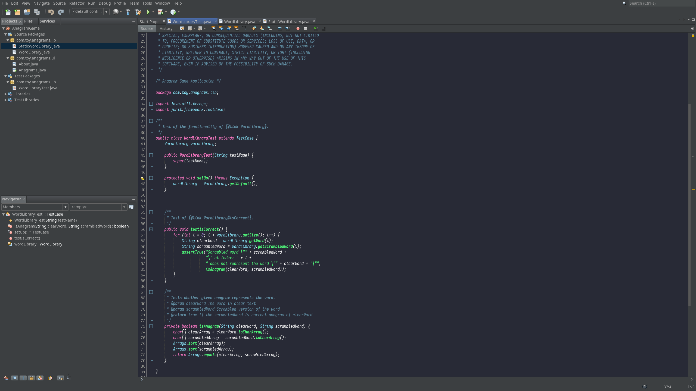

# Dracula Fonts & Colors for Netbeans

## Introduction

This is a simple approach to have [Dracula theme's](https://draculatheme.com/) colors in Netbeans.

It is adviced to use the [Darcula appearance theme](http://plugins.netbeans.org/plugin/62424/darcula-laf-for-netbeans) with these *Fonts & Colors* settings.

The font used in these settings - and in the screenshot below - is called [Iosevka](https://be5invis.github.io/Iosevka/), but of course you can use any font with it.

## Installation

Pretty simple! Just clone/download this repository and ZIP the `config/` folder in it. Then in Netbeans you go into *Tools -> Options* and on the bottom you click the button *Import...*. Select your ZIP file and it should show you *Dracula Trollwut* settings to import.
